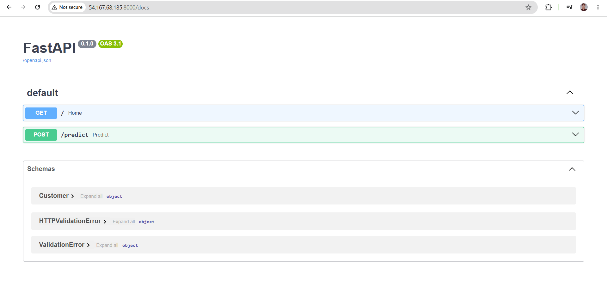
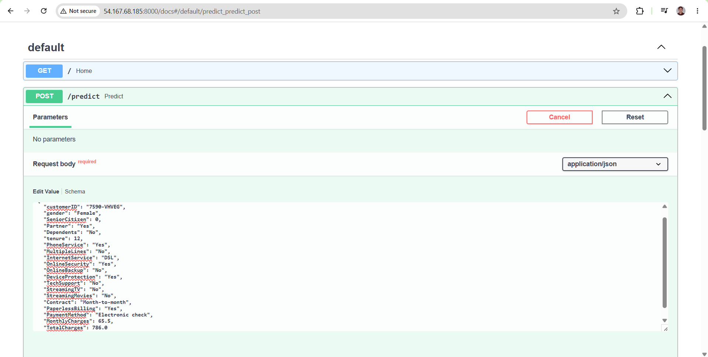
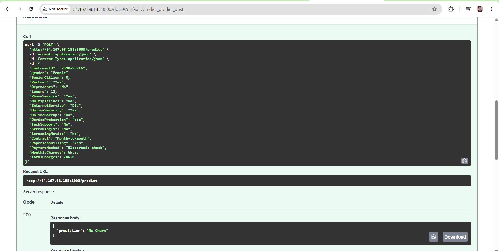
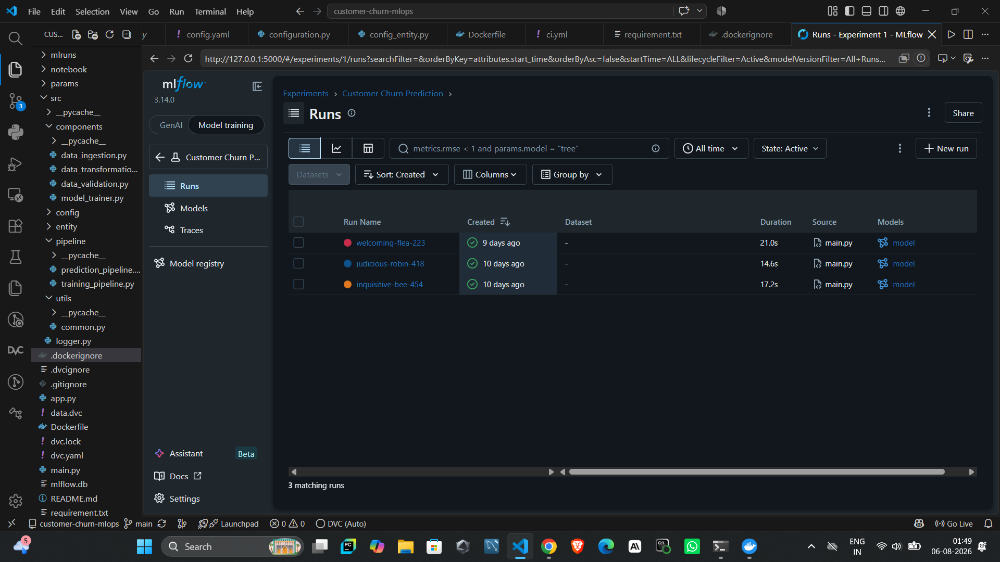
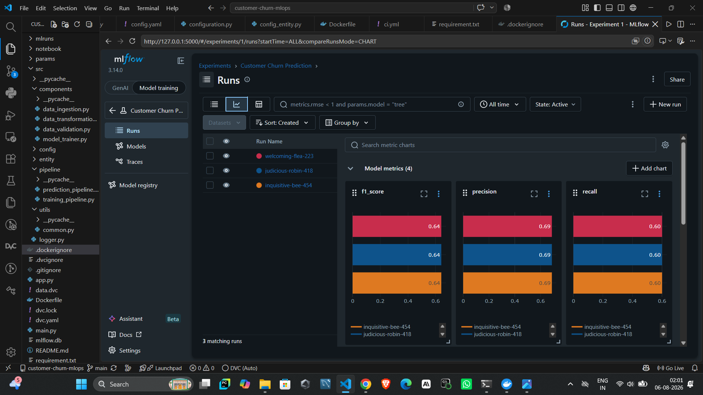
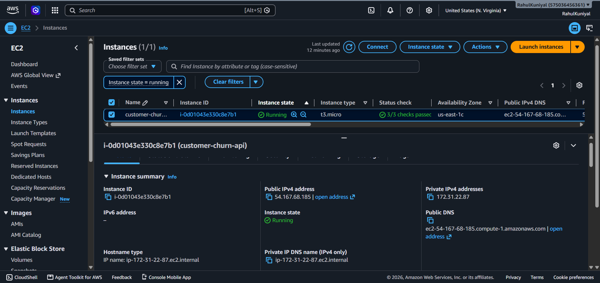

# 🚀 Customer Churn Prediction API | End-to-End MLOps Pipeline


---

# 📌 Project Overview

This project demonstrates a complete **End-to-End MLOps workflow** for predicting customer churn using Machine Learning.

It covers the complete lifecycle of an ML project—from data ingestion and preprocessing to model training, experiment tracking, data versioning, API development, containerization, and cloud deployment.

The application is deployed as a **FastAPI REST API** inside a **Docker container** on **AWS EC2**, with datasets and model artifacts versioned using **DVC** and stored remotely on **AWS S3**.

---

# 🏗️ System Architecture

```text
                    Client
                       │
                       ▼
              FastAPI REST API
                       │
                       ▼
              Prediction Pipeline
                       │
        ┌──────────────┴──────────────┐
        ▼                             ▼
 preprocessor.pkl                model.pkl
        │                             │
        └──────────────┬──────────────┘
                       ▼
               Churn Prediction
                       │
                       ▼
                 JSON Response
```

---

# ☁️ Deployment Architecture

```text
            GitHub Repository
                    │
                    ▼
             AWS EC2 Instance
                    │
             Docker Container
                    │
                  FastAPI
                    │
         Customer Churn Model
                    │
              Prediction API
```

---

# ✨ Features

- End-to-End MLOps Pipeline
- Modular Project Structure
- Configuration Driven Development
- Scikit-Learn Pipeline
- Data Validation
- Feature Engineering
- Logistic Regression Model
- MLflow Experiment Tracking
- DVC Data & Model Versioning
- AWS S3 Remote Storage
- FastAPI REST API
- Dockerized Deployment
- AWS EC2 Deployment
- Interactive Swagger Documentation

---

# 🛠 Tech Stack

| Category | Technology |
|------------|----------------|
| Programming Language | Python |
| Machine Learning | Scikit-Learn |
| Data Processing | Pandas, NumPy |
| Visualization | Matplotlib |
| API | FastAPI |
| API Server | Uvicorn |
| Experiment Tracking | MLflow |
| Data Versioning | DVC |
| Cloud Storage | AWS S3 |
| Cloud Platform | AWS EC2 |
| Containerization | Docker |
| Configuration | YAML |
| Version Control | Git & GitHub |

---

# 📂 Project Structure

```text
customer-churn-mlops/

├── app.py
├── main.py
├── Dockerfile
├── README.md
├── dvc.yaml
├── dvc.lock
├── data.dvc
├── requirement.txt
│
├── config/
├── params/
├── data/
├── artifacts/
├── images/
│
├── src/
│   ├── components/
│   ├── config/
│   ├── entity/
│   ├── pipeline/
│   ├── utils/
│   └── logger.py
│
└── notebook/
```

---

# ⚙️ Pipeline Workflow

```text
Raw Dataset
      │
      ▼
Data Ingestion
      │
      ▼
Data Validation
      │
      ▼
Data Transformation
      │
      ▼
Feature Engineering
      │
      ▼
Model Training
      │
      ▼
MLflow Tracking
      │
      ▼
Model Serialization
      │
      ▼
FastAPI Prediction API
```

---

# 📊 MLflow Experiment Tracking

The project tracks:

### Parameters

- C
- max_iter
- random_state

### Metrics

- Accuracy
- Precision
- Recall
- F1 Score

### Artifacts

- Confusion Matrix
- Classification Report
- Trained Model

---

# 🔄 DVC Pipeline

Run complete pipeline

```bash
dvc repro
```

Push artifacts

```bash
dvc push
```

Pull artifacts

```bash
dvc pull
```

---

# 🚀 API Endpoints

| Method | Endpoint | Description |
|----------|------------|----------------|
| GET | / | Health Check |
| POST | /predict | Predict Customer Churn |
| GET | /docs | Interactive Swagger UI |

---

# 🐳 Docker Deployment

Build Docker image

```bash
docker build -t customer-churn-api .
```

Run Docker container

```bash
docker run -d -p 8000:8000 customer-churn-api
```

---

# ☁️ AWS Deployment

Deployment Steps

- Launch EC2 Instance
- Configure Security Groups
- Install Docker
- Configure AWS CLI
- Pull DVC artifacts from AWS S3
- Build Docker Image
- Run FastAPI Container
- Access Swagger Documentation

---

# 📊 Dataset

Dataset:

**Telco Customer Churn Dataset**

Target Variable

```
Churn
```

---

# 📈 Model Performance

Current Model

- Logistic Regression

Tracked Metrics

- Accuracy
- Precision
- Recall
- F1 Score

Artifacts

- Trained Model
- Confusion Matrix
- Classification Report

---

# 📸 Project Screenshots

## 🚀 FastAPI Swagger UI

The FastAPI application provides an interactive Swagger UI for testing API endpoints directly from the browser.



---

## 📝 Customer Churn Prediction Request

Example JSON payload submitted to the `/predict` endpoint.



---

## ✅ Prediction Response

Prediction returned by the deployed FastAPI application after processing customer information.



---

## 📊 MLflow Experiment Runs

MLflow experiment tracking showing all training runs recorded during model development.



---

## 📈 MLflow Metrics Dashboard

Comparison of evaluation metrics across different experiment runs using the MLflow dashboard.



---

## ☁️ AWS EC2 Deployment

The FastAPI application is deployed inside a Docker container on an AWS EC2 instance.



# ⚡ Challenges Solved

During deployment, several practical engineering challenges were encountered and resolved:

- Configured DVC with AWS S3
- Managed model artifacts outside Git
- Resolved Docker build context issues
- Fixed `.dockerignore` excluding model artifacts
- Solved Docker storage limitations on EC2
- Configured EC2 Security Groups
- Dockerized FastAPI deployment
- Successfully served ML predictions through a public REST API

---

# 🔮 Future Improvements

- GitHub Actions CI/CD
- Kubernetes Deployment
- Monitoring & Logging
- Automated Model Retraining


---

# 👨‍💻 Author

**Nand Kishor**

### GitHub

https://github.com/rrahulkuniyal80-netizen/customer-churn-mlops

### LinkedIn

[https://www.linkedin.com/in/nand-kishor-11077924b/](https://www.linkedin.com/in/nand-kishor-11077924b/)

---

## ⭐ Support

If you found this project useful, consider giving it a ⭐ on GitHub!
